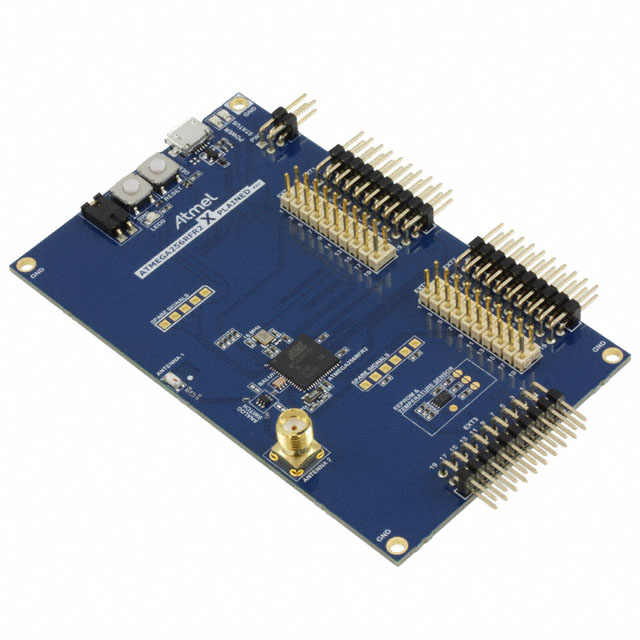
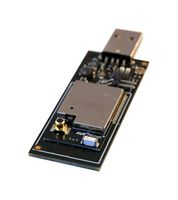
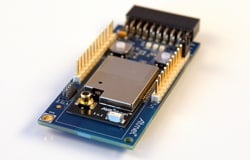
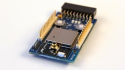

# Flow

Flow is a tiny C++ wrapper around Atmel's lightweight mesh framework, featuring: 

* A simple mesh network built on the 802.15.4 standard
* Low power
* 16 different endpoints (endpoints can be reserved for specific uses: e.g., sensor data, control, etc.)
* Listeners
* Non-blocking transmissions
* Strongly typed configuration and callback-oriented design

The library uses the [Embedded Template Library](https://www.etlcpp.com) to avoid use of the heap and have increased safe guards against buffer overflows. 

The flow library exposes a `mesh` module which is the base for every mesh application. A convenience `publisher` module that builds on the functionality in the `mesh` module is provided. It forms the basis for a node that publishes at a regular interval and goes to sleep for the remaining time. The example application found in `example/publisher` uses the publisher module.

The example project found in `example/base_station` forms the basis for a base node that takes in the data published from the publisher and can relay them further or do some processing on the data.

### Different types of nodes

When the mesh module is initialized, it takes in a configuration specifying, among other things, the address of the node in the mesh network. The following specification is used for the addresses:

- 0x0000-0x7FFF: Routers (coordinators or relays)
- 0x8000-0xFFFF: End-devices

This makes it possible to construct a chain on the following way:

```
+------------------------+
|      Base Station      |
|        (0x0000)        |
+-----------+------------+
            |
            |
+-----------+------------+
|         Relay          |
|       (0x0001)         |
+----------+-------------+
      |           |     
      |           |     
+-----+----+  +----+-----+
| Device 1 |  | Device 2 |
| (0x8001) |  | (0x8002) |
+----------+  +----------+
```

### Supported boards

| Board                      |    MCU        |                              Image                                                                |
|----------------------------|---------------|---------------------------------------------------------------------------------------------------|
| ATmega256RFR2 Xplained Pro | ATmega256RFR2 |  |
| ATZB-X-233-USB             | ATxmega256A3U |                          |
| ATZB-X-233-XPRO            | ATxmega256A3U |                        |
| ATZB-256RFR2-XPRO          | ATmega256RFR2 |                    |

### Repository Structure

* `src`: Contains the C++ wrapper layer and a CMake port of the required ASF drivers as well as the lightweight mesh framework
* `cmake`: Cmake modules for toolchains and the library 
* `examples`: Example applications

## Setup

Requirements:
- avr-gcc
- CMake
- avrdude
- Optional: dfu-programmer (for the ATZB-X-233 USB kit)

To get started, look at the examples in the `examples` folder. An `env` file can be used to not expose security keys, channels, PAN ID etc. in source control. An example `env` file is in the root of the examples folder. The file is on the following format:

```
_SECURITY_KEY=MySecurityKey
_APP_PANID=0x1234
_APP_CHANNEL=0x01
```

*Note: The maximum length of the security key is 16 bytes. A key longer than this will be clamped to 16 bytes.*

1. Navigate to an example in the `examples` folder
2. `mkdir build && cd build && cmake .. && make -j`
3. `make flash`

The default CMake target is `release`. To build for debug, use `cmake -DCMAKE_BUILD_TYPE=Debug .. && make -j`. The preprocessor directive `MESH_ENABLE_LOGGING` dictates whether logging is enabled or not for the internal functionality in the mesh library. 


### Getting started with a new application

The examples provided in the `examples` folder provides a starting point for new applications and can be used as a reference for new applications. The convenience `publisher` module also forms a starting point for a more complex application with a state machine.
